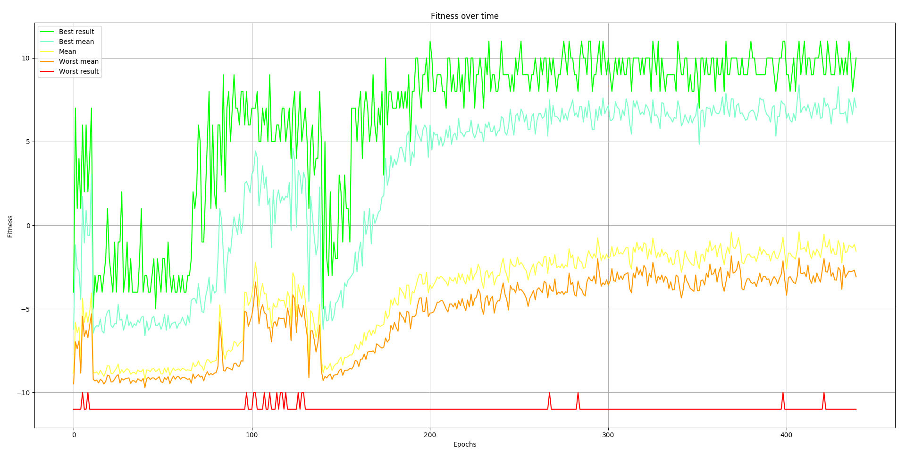

# Learning self learning

A Repository for me to learn and test my algorithms for self learning

## Pong

This one is just a simple pong game. Here I wanted to do (almost) everything from scratch. 
Using Pyglet do develop a playable pong game, building a neuranet class and then implementing a genetic algorithm to train it.

### Prerequisites

Open PythonPong/pong.py in any editor, and install all imported dependencies that are not in the same folder as it (you are smart and know python, you can figure this out)

### Using (and my results)

The script can run with 4 arguments:
train (default)
validate
play
plot

Use 

```
Python3 PythonPong/pong.py
```
or
```
Python3 PythonPong/pong.py train
```
To start from scratch, it will generate a random population of neuralnetworks, assign a colour to each one of them and pit it against the game automatic player (simple logic that follows the ball).
Every epoch will have all player simultaneously playing in the same window, and after each epoch, the training statistics graphs will update:


On the right side of the screen, you can see the active neuralnet that made more points.
On top of the game window, there are some colourful blocks. the first one is the colour of the best player from last round, the second, the mean of the colours of all players, and the other ones are the partial means of all the players (first one are mean of some of the best, and last one is the mean of some of the worst players). This should be useful to see convergence but since I could not make it converge in the time I allotted for this project, I can't say for sure if its useful.


For me, after a lot of time I got this:



Tweak the code and values in it so you can try and get a better result!

If you want to run be able to interact with the plot and not stop your training, just run:
```
Python3 PythonPong/pong.py plot
```
It will open a new window with the plot where you can interact freely

IMPORTANT: While running, it generates 3 dump_files that are upgraded each epoch:
* dump_history
* dump_population
* dump_color

The history is the file that is used to plot the graph, population keeps all individual on the last population you have trained and color, its associated colors.
If you want to reset any of those, just delete the files, You can keep training from where you stopped and backup your files for tests and such.
These files are used for validating and playing

### Validating
At any time you can validate the last best neuralnetwork by running:
```
Python3 PythonPong/pong.py validate
```
Don’t worry, it will not affect any training.
This will take the best individual from last epoch (saved on file) and run 100 instances of it against the simple game script.
At the end it will print out 3 values:
[Best result found, mean of all results, worst result]
This helps you see how well the individual actually fare instead of 1 lucky sample of game.

### Playing

To play against the last best result, just run:
```
Python3 PythonPong/pong.py play
```

Have fun!